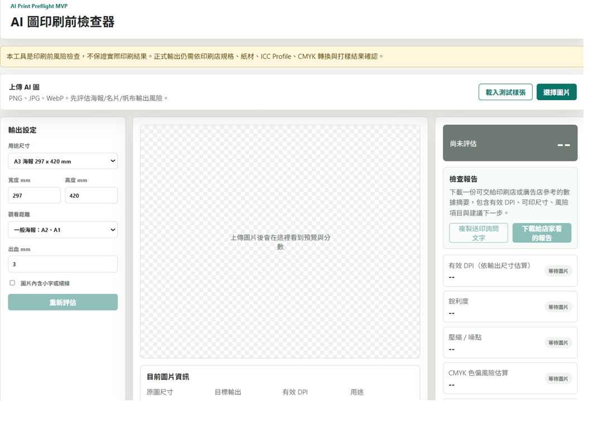
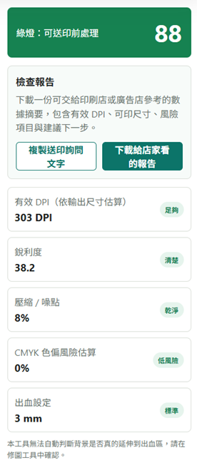
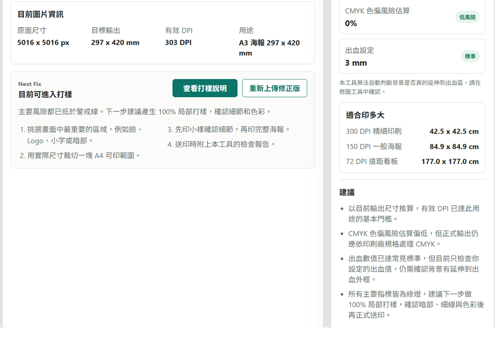

# AI 圖印刷前檢查與修復指南

AI Print Preflight Guide 是一個純前端工具，用來協助使用者在送印前快速評估 AI 生成圖片的印刷風險，並整理下一步修復方向。它不取代印刷店或完稿師，而是幫使用者先看懂圖片是否適合指定尺寸輸出、哪裡可能需要修正，以及該如何把資訊交給印刷店確認。

## Demo

GitHub Pages Demo：

https://zxc02621948-sketch.github.io/ai-print-preflight/

## 使用說明截圖

### 主畫面



### 檢查報告



### 修復建議



## 功能清單

- 上傳 AI 生成圖片，支援 PNG、JPG、WebP
- 選擇用途尺寸：A3、A2、A1、名片、帆布條、自訂尺寸
- 顯示目前圖片資訊：
  - 原圖尺寸
  - 目標輸出尺寸
  - 有效 DPI
  - 用途
- 計算有效 DPI，依照輸出尺寸估算圖片是否適合印刷
- 顯示紅黃綠燈總分
- 評估主要風險項目：
  - 有效 DPI
  - 銳利度
  - 壓縮 / 噪點
  - CMYK 色偏風險估算
  - 出血設定
- 顯示「適合印多大」：
  - 300 DPI 精細印刷
  - 150 DPI 一般海報
  - 72 DPI 遠距看板
- 依最主要問題推薦下一步修復工具與操作步驟
- 支援修復工具說明彈窗，避免使用者誤點外部工具
- 可複製送印詢問文字，方便直接傳給印刷店或廣告店
- 可下載檢查報告 TXT，提供給店家參考

## 使用方式

1. 打開 `index.html`
2. 上傳 AI 生成圖片，或點選「載入測試樣張」
3. 選擇用途尺寸，例如 A3 海報、A2 海報、名片或帆布條
4. 檢查右側總分與各項風險
5. 查看圖片下方的「目前圖片資訊」與「Next Fix」
6. 依建議使用外部工具修正，例如放大、降噪、補出血
7. 修正後重新上傳，再次評估
8. 點選「複製送印詢問文字」或「下載給店家看的報告」

## 免責說明

本工具是印刷前風險檢查工具，不保證實際印刷結果。

實際印刷品質仍會受到以下因素影響：

- 印刷店規格
- 紙材
- 印刷機與油墨
- ICC Profile
- RGB / CMYK 轉換流程
- PDF/X 或完稿格式
- 裁切與出血處理
- 是否有實體打樣

本工具提供的 CMYK 色偏風險為估算，不等於專業色彩管理或正式印前檢查。正式輸出前，仍建議依印刷店或廣告店規格確認。

出血項目目前只檢查使用者設定的出血數值，不會自動判斷圖片背景是否真的延伸到出血區。送印前請在修圖或排版工具中確認。

## 給印刷店的詢問文字

工具內建「複製送印詢問文字」功能，會產生類似以下內容：

```text
你好，我想印 A3 海報 297 x 420 mm。
檔案像素為 3508 x 4961 px，目標輸出尺寸為 297 x 420 mm，目前依尺寸估算的有效 DPI 約 300。
目前設定出血 3 mm，但仍需確認背景是否有延伸到出血區。
CMYK 色偏風險為估算值，若需要 CMYK、PDF/X 或指定 ICC Profile，請協助轉檔或告知規格。
請問這樣適合送印嗎？如果需要調整解析度、出血、裁切或轉色，也請告訴我。
```

## 未來規劃

- 加入比例與裁切風險檢查，提醒橫圖放直式海報時可能產生大面積留白
- 加入暗部印刷風險檢查，避免暗色 AI 圖印出來糊成一團
- 加入高飽和光效風險偵測，例如藍色電光、霓虹綠、紫色特效
- 加入 100% A4 局部打樣產生器
- 加入出血預覽框與安全邊界預覽
- 支援匯出高解析 PNG 或印刷交付包
- 支援向量化模式，處理 Logo、徽章、圖示類素材
- 支援多張圖片批次檢查
- 加入更多部署範例與使用情境說明

## 技術說明

目前版本為純前端靜態工具，不需要後端或 AI API。

主要技術：

- HTML
- CSS
- JavaScript
- Canvas 影像取樣

可直接部署到 GitHub Pages、Render Static Site、Netlify、Vercel 或任何靜態網站服務。
